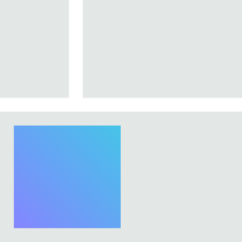

# flecss

**flecss** (pron. ‘_flex_’): Simple and minimal CSS framework utilising the power of flexbox.


Unlike _Bootstrap_ or _Tailwind_, flecss does not mediate CSS in its entirety. Instead, it follows a minimal approach: Each class bases on a style requirement common for the majority of web-based designs <sup>1</sup>. Above that, styling is leat to individual stylesheets.

> 📦 flecss ships with a total of &#8232;`10kB`, compared to Bootstrap with `248kB` <sup>2</sup>.

[1. Integration](#integration)  
[2. Classes](#classes)  
&emsp; [2.1 `.c` Condition](#%EF%B8%8F⃣-c-condition)  
&emsp; [2.2 `.f` Flex](#%EF%B8%8F⃣-f-flex)  
&emsp; [2.3 `.m` Margin](#%EF%B8%8F⃣-m-margin)  
&emsp; [2.4 `.p` Padding](#%EF%B8%8F⃣-p-padding)  
&emsp; [2.5 `.s` Section + `.w` Wrapper](#%EF%B8%8F⃣-s-section--%EF%B8%8F⃣-w-wrapper)  
&emsp; [2.6 `.t` Text](#%EF%B8%8F⃣-t-text)  
&emsp; [2.7 `.v` Viewport](#%EF%B8%8F⃣-v-viewport)  
[3. Modifiers](#modifiers)  
&emsp; [3.1 Space](#%EF%B8%8F⃣-space)  
[4. Build Interface](#build-interface)  
&emsp; [4.1 Breakpoints](#%EF%B8%8F⃣-breakpoints)  
&emsp; [4.2 Colors](#%EF%B8%8F⃣-colors)  
&emsp; [4.3 Themes](#%EF%B8%8F⃣-themes)  
[5. Abstract Example](#abstract-example)  

## Integration

#### From CDN

``` html
<link rel="stylesheet" href="https://raw.githubusercontent.com/t-ski/flecss/main/dist/flecss.css">
```

#### From NPM

``` cli
npm install -D flecss
```

> ℹ️ Certain CSS resetsa are inherent to a flecss integration (see [_reset.scss](./src/_reset.scss)). 

#### Get Started

The flecss class anatomy consists of a purposeful classifier `A`, and possibly a specifier `B`: `.A_B`. An unspecific class – i.e. without a specifier suffix – represents the default style. Each class also associates with a handy shorthand classifier.

> ℹ️ Unlike for _BEM_, specific classes are standlone, i.e. inherit all shared style foundations. It is thus not required to assign the joint default and specific class name <sub>`❌ .p.p_top` `✅ .p_top`</sub>.

## Classes

### *️⃣ `.c` `.condition`

The **condition** class represents toggleable layout conditions. At that, the explicit class describes the less common condition, whereas absence implies the complementary (common) condition.

` _disable` &emsp; **Greyout and disable for interaction.**  
`    _hide` &emsp; **Hide, but keep layout.**  
`_collapse` &emsp; **Hide, including layout (bounding box).**  

| <sup>&emsp;</sup> | <sup>`_disable`</sup> | <sup>`_hide`</sup> | <sup>`_collapse`</sup> |
| :- | :- | :- | :- |
|  |  |  |  |

#### Example

``` html
<button class="c--disable">Submit</button>
```

### *️⃣ `.f` `.flex`

The **flex** class is the vibrant layouting class in flecss. It allows for a number of flexbox-based content arrangements.

` _1` - `_9` &emsp; **`n` equal-sized content tiles per row with a homogeneous margin in between.**  

| <sup>`_1`</sup> | <sup>`_2`</sup> | <sup>`_3`</sup> |
| :- | :- | :- |
|  |  |  |

#### Example

``` html
<div class="f_2">
  
  <p>Panel on web technologies.</p>
</div>
```

### *️⃣ `.m` `.margin`

The **margin** class simply induces a margin to the respective element.

<sup>`   `</sup> <sup>`        default`</sup> &emsp; **Margin to all sides.**  
`_h` `_horizontal` &emsp; **Margin to top and bottom sides.**  
`_v` `  _vertical` &emsp; **Margin to left and right sides.**  
`_t` `       _top` &emsp; **Margin to top side only.**  
`_b` `    _bottom` &emsp; **Margin to bottom side only.**  
`_l` `      _left` &emsp; **Margin to left side only.**  
`_r` `     _right` &emsp; **Margin to right side only.**  

| <sup>`default`</sup> | <sup>`_horizontal`</sup> | <sup>`_vertical`</sup> | <sup>`_top`</sup> | <sup>`_bottom`</sup> | <sup>`_left`</sup> | <sup>`_right`</sup> |
| :- | :- | :- | :- | :- | :- | :- |
|  |  |  |  |  |  |  |

#### Example

``` html
<h2 class="p_b">Event</h2>
<p>Panel on web technologies.</p>
```

### *️⃣ `.p` `.padding`

The **padding** class simply induces a padding to the respective element.

<sup>`   `</sup> <sup>`        default`</sup> &emsp; **Padding to all sides.**  
`_h` `_horizontal` &emsp; **Padding to top and bottom sides.**  
`_v` `  _vertical` &emsp; **Padding to left and right sides.**  
`_t` `       _top` &emsp; **Padding to top side only.**  
`_b` `    _bottom` &emsp; **Padding to bottom side only.**  
`_l` `      _left` &emsp; **Padding to left side only.**  
`_r` `     _right` &emsp; **Padding to right side only.**  
 
| <sup>`default`</sup> | <sup>`_horizontal`</sup> | <sup>`_vertical`</sup> | <sup>`_top`</sup> | <sup>`_bottom`</sup> | <sup>`_left`</sup> | <sup>`_right`</sup> |
| :- | :- | :- | :- | :- | :- | :- |
|  |  |  |  |  |  |  |

#### Example

``` html
<div class="p">
  <h2>Event</h2>
</div>
```

### *️⃣ `.s` `.section` + *️⃣ `.w` `.wrapper`

The **section** and **wrapper** class describe common vertical layouting containers. A section stretches across the full width, with a small affixed vertical content padding. The wrapper has a limited width and is centered within a section, with an extra large affixed horizontal content padding. Used in combination, the section-wrapper layouting classes provide a simple yet powerful tool.

| <sup>`.s`</sup> | <sup>`.w`</sup> | <sup>`.s` `>` `.w`</sup> |
| :- | :- | :- |
|  |  |  |

> `--wrapper-width`: `1420px`

#### Example

``` html
<section class="section">
  <div class="wrapper">
    <h2>Event</h2>
  </div>
</div>
```

### *️⃣ `.t` `.text`

The **text** class helps with applying deviant text formatting.

`_l` `   _left` &emsp; **Align text to the left.**  
`_r` `  _right` &emsp; **Align text to the right.**  
`_c` ` _center` &emsp; **Align text to the center.**  
`_j` `_justify` &emsp; **Align text across the whole width.**  

| <sup>`_left`</sup> | <sup>`_right`</sup> | <sup>`_center`</sup> | <sup>`_justify`</sup> |
| :- | :- | :- | :- |
|  |  |  |  |

#### Example

``` html
<p class="t_center">
  Panel on web technologies.
</p>
```

### *️⃣ `.v` `.viewport`

The **viewport** class enables .

`    _s` `     _small` &emsp; **Show on small viewport only.**  
`    _m` `    _medium` &emsp; **Show on medium viewport only.**  
`    _l` `     _large` &emsp; **Show on large viewport only.**  
`_not-s` ` _not-small` &emsp; **Do not show on small viewport.**  
`_not-m` `_not-medium` &emsp; **Show on medium viewport only.**  
`_not-l` ` _not-large` &emsp; **Show on large viewport only.**  

| <sup>`_large`</sup> | <sup>`_not-large`</sup> |
| :- | :- |
|  |  |

**Breakpoints**

> Breakpoint `l`: `1 × --wrapper-width` = `1420px`  
> Breakpoint `m`: `⅔ × --wrapper-width` = `~947px`  
> Breakpoint `s`: `⅓ × --wrapper-width` = `~473px`  

> *️⃣ Breakpoints are not mutable, i.e. overriding `--wrapper-width` does not affect the breakpoints.

#### Example

``` html
<div class="p p--large">
  <h2>Event</h2>
</div>
```

## Modifiers

Instead of a specifier, a double dash indicated modifier `C` can be used to override a variable style property: `.A--C`. Each modifier is therefore linked with global SCSS variable.

> ℹ️ Modifiers simply override a certain variable. They are in fact not standalone like specified classed. Like for _BEM_, it is thus required to assign the joint class and modified class name <sub>`❌ .p--large` `✅ .p.p--large`</sub>.

### *️⃣ Space

The space modifier describes a space unit that applies with all area space-related classes. For instance, using `.m m--large` would result in subsequently larger margin compared to just `.m` (which equals `.m .m--medium`).

`--xs` `--extra-small` &emsp; **Extra small spacing.**  
` --s` `      --small` &emsp; **Small spacing.**  
` --m` `     --medium` &emsp; **Medium spacing <sup>`default`</sup>.**  
` --l` `      --large` &emsp; **Large spacing.**  
`--xl` `--extra-large` &emsp; **Extra large spacing.**  

The size of a space unit (e.g. `--s`) scales progressively aroud the `--m` (≡ `--space`) by a factor `--font-factor`. For instance, `--xl` corresponds to `--space * --font-factor^2` – i.e. `4rem` by default.

> `       --space`: `1rem`  
> `--space-factor`: `2.0`  

Font sizing in flecss behaves analogous to the above described spacing. Heading sizes thus scale increasingly from `h5` on.

> `  --font-size`: `16px` (≡ `1rem`)  
> `--font-factor`: `1.5`  

#### Example

``` html
<div class="p p--large">
  <h2>Event</h2>
</div>
```

## Build Interface

Integrated via NPM, flecss comes with a mature build interface.

> ℹ️ The flecss build interface bases on [SASS](https://github.com/sass/dart-sass) transpilation and [clean-css](https://github.com/clean-css/clean-css) optimisation.

> ℹ️ Working with flecss on the SCSS layer enables custom overrides of the global flecss variables (e.g. `--space`).

#### Via CLI

``` cli
npx flecss <path:source> <path:target> [--<flag:key|-<flag:shorthand>]*
```

| Flag | Description |
| :- | :- |
| `--standalone` `-S` | Build without including flecss. | 
| `--watch` `-W` | Watch file changes for incremental builds. | 

#### Via API

``` ts
interface IBuildOptions {
  isDevelopment?: boolean;
  isStandalone?: boolean;
}
```

``` ts
function buildCSS(sourcePath: string, targetPath: string, options?: IBuildOptions & {
  modTimeTolerance?: number;
}): Promise<{
  executionTimeMs: number;
  sourcePath: string;
  targetPath: string;
  targetSizeByte: number;
}>
```

``` ts
function transpile(sourcePath: string, targetPath: string, options?: IBuildOptions): {
  css: string;
  loadedUrls: string[];
}
```

#### Example

``` js
const flecss = require("flecss");

flecss.buildCSS("./app.scss");
```

Notably, the flecss build interface supplies a set of helpful utility mixins:

### *️⃣ Breakpoints

Apply styles below a certain breakpoint (revisit [breakpoints](#%EF%B8%8F⃣-v-viewport)).

``` scss
@include flecss_breakpoint--s
@include flecss_breakpoint--m
@include flecss_breakpoint--l
```

### *️⃣ Colors

Define a color through a global CSS variable (property) including biaxial shading.

``` scss
@include flecss_color($name, $color)
```

``` scss
--color-#{$name}: $color
--color-#{$name}--light: lighten($color, 10%)
--color-#{$name}--dark: darken($color, 10%)
```

### *️⃣ Themes

Apply styles for a certain color scheme (system).

``` scss
@include flecss_theme--light
@include flecss_theme--dark
```

## Abstract Example

<sup>🔍 […] [example/](./example/)</sup>
``` html
<style>
  .section {
    background-color: cornsilk;
  }
</style>
<main>
  <section class="section">
    <div class="wrapper">
      <h2>About</h2>
      <p class="margin--l m_t text_c">
        flecss is a modern and simple CSS framework.
      </p>
      <a class="viewport_not-s" href="/sandbox">Try yourself</a>
    </div>
  </section>
</main>
```

---

<sub><sup>1</sup> As of 100+ analyzed web application designs.</sub>  
<sub><sup>2</sup> As of distribution `bootstrap.css` available June, 2024.</sub>  

##

<sub>&copy; Thassilo Martin Schiepanski</sub>